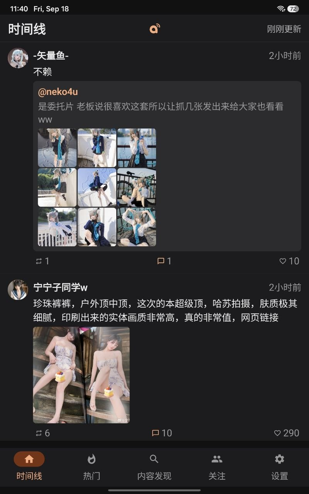
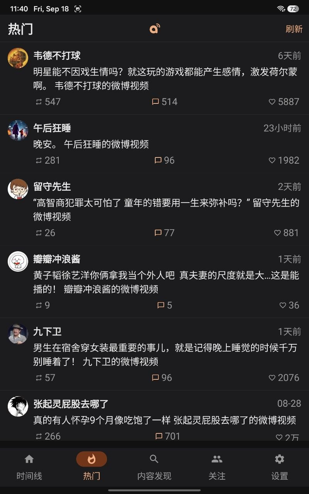

# WeiboX

**自托管的第三方微博方案：服务端持续抓取 + 轻量安卓客户端。**

> [!IMPORTANT]
> ## 这是一个「匿名浏览」工具
>
> **关注列表存在你自己的服务器上，和任何微博账号都没有关系。**
> 它**不会、也无法**从登录 Cookie 里读取该微博账号在微博上的关注列表——
> 想看谁，得自己在 WebUI 或 app 里搜索并添加。两边的关注互不相干。
>
> **所有需要登录身份的操作一律不支持**：点赞、评论、转发、私信、发微博。
> 这不是「还没做」，而是设计如此——代码里对微博只有读请求，没有任何写接口。
> 你能做的只有浏览：时间线、热门、主页、搜索、看评论。
>
> Cookie 的唯一作用是**提高读取权限、减少被防爬拦截**，不会用它代表你做任何事。
> 不填也能用，走访客模式，只是更容易撞验证码。

WeiboX 分两部分：一个长期运行的**服务端**（`server/`）负责定时抓取你关注用户的微博、扛微博的防爬与验证码；一个**安卓客户端**（`app/`）只跟你自己的服务端通信，浏览体验完整（时间线、热门流、特别关注、主页、关注列表、评论、搜索、关注管理，支持浅色/深色/跟随系统主题）。

```
   安卓 app  ──HTTPS /api/v1──►  你的 WeiboX Server  ──►  m.weibo.cn
  (只连 server)                  (扛防爬/验证码/缓存)      (真实数据源)
```

## 截图

| 时间线 | 热门 |
|---|---|
|  |  |

## 为什么是客户端-服务器

早期 WeiboX 是单机 app 直连微博，但微博有防爬，必须前后台限速抓取、还要在端上处理验证码。改成服务端架构后：

- **服务端扛防爬**：长期运行、可把抓取间隔调长，遍历全部关注用户定时抓取并缓存。
- **app 极简**：拉的是服务端**已缓存**的数据，无防爬顾虑，打开即同步、下拉刷新，无任何后台服务。
- **验证码远程解**：服务端撞到验证码 → 推送通知到 app（或 WebUI）→ 你在界面里实时点/滑解锁 → 服务端继续。
- **多端共享**：服务端是单一数据源，关注列表 / 抓取 / Cookie 都在服务端集中管理。

## 组成

| 目录 | 说明 |
|---|---|
| [`server/`](server/README.md) | **WeiboX Server** —— FastAPI 服务端：定时抓取、访客 session 引导、验证码交互、统一 `/api/v1`、WebUI 管理后台、WebDAV 备份、FCM 推送、Docker 部署。**详见 [server/README.md](server/README.md)**。 |
| `app/` | **安卓客户端** —— Jetpack Compose 客户端，数据全部来自你的服务端。 |

## 快速开始

### 1. 部署服务端

**不想自己构建**，直接用已发布的官方镜像（多架构，x86 / ARM 服务器都能跑）：

```bash
mkdir weibox && cd weibox
cat > docker-compose.yml <<'EOF'
services:
  weibox-server:
    image: bidabrain/weibox-server:latest
    container_name: weibox-server
    restart: unless-stopped
    ports:
      - "127.0.0.1:8000:8000"
    volumes:
      - ./data:/data
    environment:
      WEIBOX_ADMIN_PASSWORD: "你的强密码"
      WEIBOX_ENABLE_BROWSER: "true"
    shm_size: "1gb"
EOF
docker compose up -d
```

或者**从源码构建**：

```bash
cd server
echo "WEIBOX_ADMIN_PASSWORD=你的强密码" > .env
docker compose up -d --build
```

两种方式都是打开 `http://localhost:8000` 登录 → 设置里**新建 API Token**、搜索并关注用户。
镜像里不含任何用户数据，全部状态在挂载的 `./data`。
完整部署（本地运行、Cloudflare Tunnel 公网、自行发布镜像）见 **[server/README.md](server/README.md)**。

### 2. 获取安卓客户端

#### 方式 A：下载现成的 APK（无推送）

[**Releases → latest**](https://github.com/bidabrain/weiboX-server/releases/tag/latest) 里有 CI 自动构建的签名包，装上即用。

> ⚠️ **这个包收不到 FCM 推送。** 它内置的是作者 Firebase 项目的 `google-services.json`，
> 设备会注册到作者的项目下；而要把通知发出去，**服务端必须持有同一项目的服务账号私钥**，
> 那是不会公开的。所以用 release APK 时：
>
> - 验证码通知、特别关注新微博通知**都不会到达**；
> - 验证码仍可随时在服务端 WebUI 里解，其余功能（时间线、热门、搜索、关注、评论）**一切正常**。
>
> **想要推送，就必须用自己的 Firebase 项目自行编译**，见下。

#### 方式 B：自己编译（可用推送）

本仓库**不含** `app/google-services.json`。先在 [Firebase 控制台](https://console.firebase.google.com/)
建项目、注册 Android app（包名 `com.weibox.app`）、下载 `google-services.json` 放到
**`app/google-services.json`**，再编译：

```bash
./gradlew :app:assembleRelease
# 产物：app/build/outputs/apk/release/app-release.apk
```

同时在**同一个 Firebase 项目**里生成服务账号私钥（项目设置 → 服务账号 → 生成新的私钥），
重命名为 `firebase-key.json` 放到服务器的 **`data/firebase-key.json`**（Docker 部署即宿主机挂载的
`./data` 目录下），重启容器即启用推送。

> 两边必须是同一个 Firebase 项目，否则设备 token 对不上，推送发出去也到不了。
> 不配私钥则推送关闭，其余功能照常；但 app 应用了 google-services 插件，**编译仍要求
> `google-services.json` 存在**。

### 3. 客户端连接服务端

装好 app → **设置** → 填**服务器地址**（如 `https://weibo.example.com`，局域网联调用 `http://192.168.x.x:8000`）+ **API Token** → 测试连接。之后时间线/主页/评论/搜索/关注全走你的服务端。

## 技术栈

**服务端**：Python · FastAPI · httpx（抓取）· Playwright（访客 session 引导 + 验证码无头浏览器）· SQLite · firebase-admin（FCM）· 原生 JS WebUI · Docker

**客户端**：Kotlin · Jetpack Compose + Material3（浅色/深色/跟随系统）· MVVM + Hilt · Room（本地缓存镜像）· OkHttp · Coil · Firebase Messaging（验证码 + 特别关注新帖推送）

## FCM 推送（可选）

两类推送：

- **验证码**：服务端抓取撞到验证码时推送 → 点通知 → app 打开验证码界面 → 实时显示验证码截图、手指点/滑 → 完成后服务端继续。
- **特别关注新微博**：被你标为特别关注的用户发了新微博、服务端抓到后推送通知（每人每轮聚合一条，首关回填不推）。

二者都需要：服务端放你 Firebase 项目的私钥 `server/data/firebase-key.json`，客户端用**同一项目**的 `google-services.json`。不配则推送关闭，验证码仍可在服务端 WebUI 里解。

配好后可在 WebUI「设置 → 推送（FCM）」里看到私钥加载状态和已注册设备，并点「发送测试推送」验证链路是否打通。

> 再次提醒：[Releases](https://github.com/bidabrain/weiboX-server/releases/tag/latest) 里的现成 APK
> 绑定的是作者的 Firebase 项目，**推送用不了**，必须自行编译。详见[上面的方式 B](#方式-b自己编译可用推送)。

## 项目结构

```
weiboX/
├── app/                      # 安卓客户端（Jetpack Compose）
│   └── src/main/java/com/weibox/app/
│       ├── MainActivity.kt           # 入口 + 通知权限 + 设备 token 上报
│       ├── CaptchaActivity.kt        # app 内验证码界面（WS 截图流 + 触摸转发）
│       ├── data/
│       │   ├── api/ServerApi.kt       # ★ 调服务端 /api/v1
│       │   ├── repository/            # Room 缓存镜像 + 服务端数据源
│       │   ├── db/ · model/ · prefs/
│       ├── fcm/                       # FirebaseMessagingService（验证码 + 特别关注推送）+ 设备注册
│       └── ui/                        # 时间线（主/特别关注/随机）/ 热门 / 主页 / 搜索 / 关注 / 设置
│
├── server/                   # WeiboX Server（FastAPI）—— 详见 server/README.md
│   ├── app/
│   │   ├── weibo/            # 抓取 client / 解析 / 访客 session / 验证码
│   │   ├── services/         # 定时抓取调度 / 数据读写 / WebDAV / FCM 推送
│   │   ├── api/              # /api/v1（浏览）· /admin（管理）· 验证码 WS
│   │   └── web/static/       # WebUI 管理后台
│   ├── Dockerfile · docker-compose.yml · docker-compose.hub.yml
│   └── README.md            # 服务端完整文档
└── README.md                # 本文件
```

## 致谢

服务端的网络请求逻辑、接口地址、请求头与限流策略，参考自开源项目 **[dataabc/weibo-crawler](https://github.com/dataabc/weibo-crawler)**。WeiboX 服务端可理解为将其数据获取层用 Python 重新组织、并加上调度 / WebUI / 验证码交互 / API 的版本。感谢原项目作者的持续维护。

## Star History

<a href="https://www.star-history.com/?repos=bidabrain%2FweiboX-server&type=date&legend=top-left">
 <picture>
   <source media="(prefers-color-scheme: dark)" srcset="https://api.star-history.com/chart?repos=bidabrain/weiboX-server&type=date&theme=dark&legend=top-left" />
   <source media="(prefers-color-scheme: light)" srcset="https://api.star-history.com/chart?repos=bidabrain/weiboX-server&type=date&legend=top-left" />
   
 </picture>
</a>
